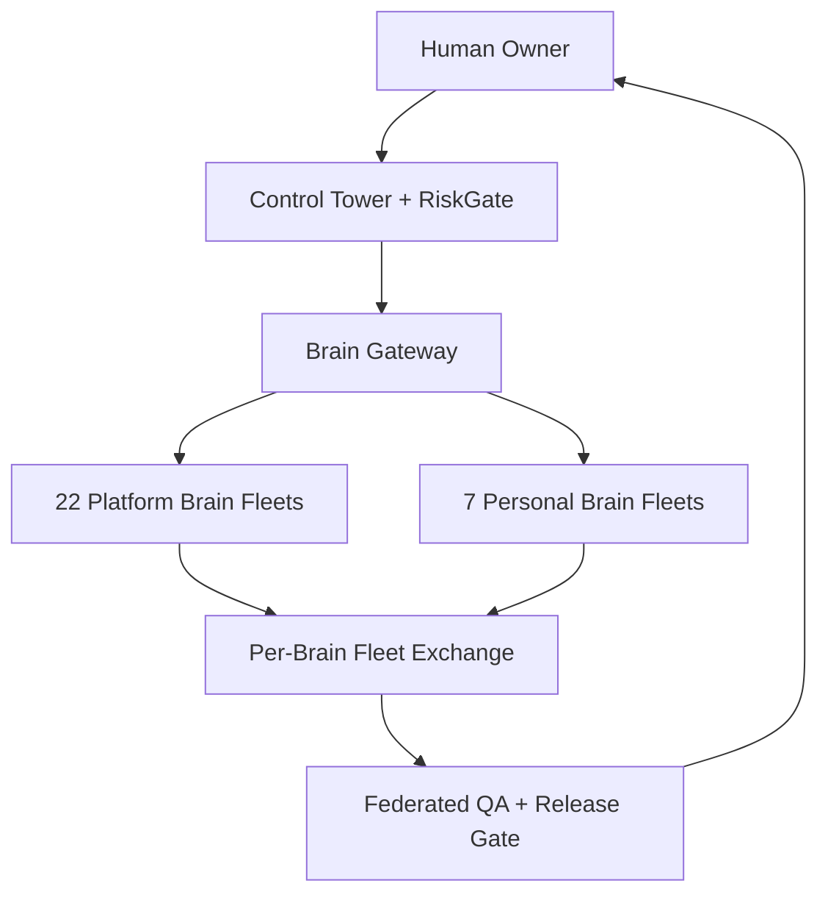
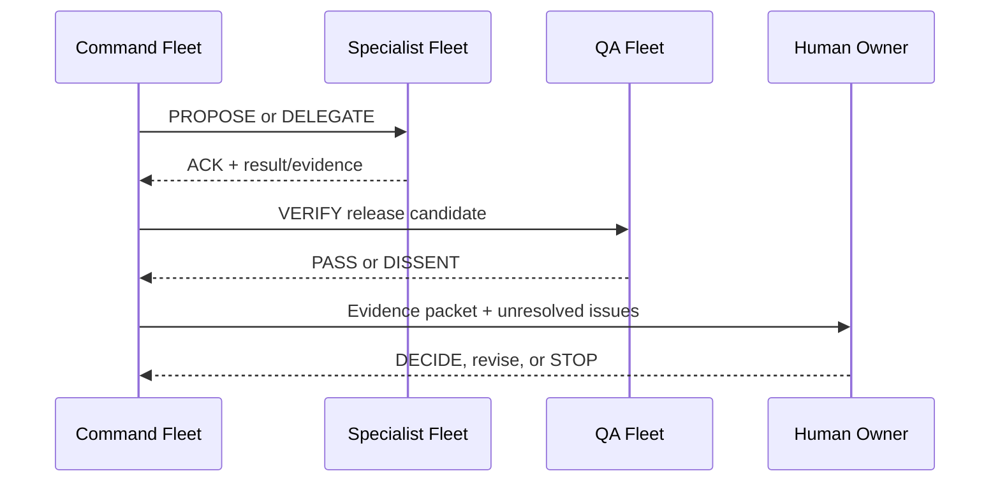

# Transparent 29-Brain AI Council v0.2

**Program:** Business of Businesses / Systems of Systems / The Encyclopedia of Everything Applied  
**Architecture:** 22 Platform Brains + 7 Personal R&D Brains  
**Core fabric:** 29 complete AI MemPalace Hermes Fabric Fable 5 Fleets + Brain Gateway + RiskGate + QA  
**Status:** Design-ready; no live provider credentials or production permissions are implied

## 1. The promise—and the truth standard

The system will give authorized humans and participating AI services an inspectable view of the building process: assignments, approved inputs, source references, assumptions, concise rationales, outputs, critiques, disagreements, tests, tool actions, costs, approvals, corrections, and release decisions.

It cannot guarantee consciousness or human-style thought, expose a provider's hidden model weights, or require private hidden chain-of-thought. Instead, it makes **work evidence** transparent: what was asked, what evidence was used, what was produced, how it was checked, why a decision was made, and who approved it.

More models are useful only when they add genuine independence or expertise. Twenty-nine agreeing guesses are not evidence. Tests, sources, reproducible artifacts, and accountable human decisions outrank votes.

## 2. Corrected operating architecture: one complete fleet per brain

Every AI Big Brain owns a complete **AI MemPalace Hermes Fabric Fable 5 Fleet**. The fleet is the brain's operational body: memory, communications, controlled creation, documentation, databases, identity, security, observability, QA, and recovery. The architecture therefore contains **29 brains and 29 complete fleets**—22 platform fleets and 7 isolated Personal R&D fleets.

- **Brain Gateway:** selects brain fleets and providers according to risk, expertise, cost, availability, and data policy.
- **Per-brain MemPalace:** stores that brain's approved knowledge, sources, artifacts, provenance, decisions, corrections, and learning state.
- **Per-brain Hermes Fabric:** handles signed internal tasks, external messages, receipts, handoffs, retries, and delivery status while preserving identity.
- **Per-brain Fable 5:** creates five controlled solution, creative, instructional, or simulation variations; every variation is labeled and evaluated.
- **Per-brain Documentation System:** maintains specifications, decisions, runbooks, changelogs, lessons, and evidence reports.
- **Per-brain Database Management System:** provides isolated operational, knowledge, vector, graph, event, and audit data stores with schema/version control.
- **Per-brain Transparency Console:** shows authorized inputs, outputs, sources, tests, dissent, costs, permissions, and status without exposing secrets or private hidden chain-of-thought.
- **RiskGate:** blocks unsafe, unauthorized, untested, over-budget, or privacy-violating actions.
- **QA:** independently verifies claims, code, educational outcomes, accessibility, and release readiness.

## 2A. Standard fleet carried by every brain

| Fleet subsystem | Required function |
|---|---|
| Brain Passport | Stable brain/fleet identity, role, owner, version, provider, capabilities, limits |
| MemPalace Memory Stack | Working, episodic, semantic, procedural, evidence, and correction memory |
| Hermes Fabric Communications | Signed envelopes, queues, receipts, routing, handoffs, timeouts, retries |
| Fable 5 Variation Engine | Five labeled candidates or perspectives with comparison and selection evidence |
| Documentation Engine | Specifications, ADRs, runbooks, changelogs, reports, tutorials, provenance |
| Database Management Plane | Relational, document, graph, vector, event, audit, backup, retention interfaces |
| Transparency Console | Mission state, sources, rationale summary, tests, dissent, costs, approvals |
| RiskGate & Permissions | Least privilege, data classification, budget limits, action approvals, stop control |
| QA & Whistleblower Node | Independent challenge, test evidence, defects, escalation, release veto recommendation |
| Observability & Diagnostics | Logs, traces, metrics, health checks, incident history, drift and quality alerts |
| Recovery & Evolution | Checkpoints, rollback, export, provider migration, lessons, approved self-improvement |

Each fleet uses the same open contracts but maintains its own namespace, keys, policy, memory, databases, documentation, budget, and audit chain. Shared infrastructure may host several fleets economically, but shared hosting must never collapse their logical identities or data boundaries.

## 2B. Fleet-to-fleet communication law

1. The sending fleet creates a signed Hermes task envelope.
2. Its MemPalace records purpose, approved context, source IDs, permissions, budget, and expected result contract.
3. The receiving fleet verifies identity, scope, classification, freshness, and authorization before accepting the task.
4. Its Fable 5 engine may generate five labeled alternatives when variation adds value; routine deterministic work does not manufacture unnecessary variants.
5. The receiving fleet returns a signed result, tests, sources, limitations, cost, and confidence—not private hidden chain-of-thought.
6. Both fleets store matching receipts and immutable hashes while retaining their own internal records.
7. Cross-tenant or Personal Vault data movement is denied unless a specific human-approved policy permits a minimized, sanitized transfer.

The Control Tower can see federation-level status and evidence but cannot silently rewrite a fleet's history. Corrections create linked superseding records.

## 2C. AI Big Brain Conversation Network

All 29 fleets can communicate through the **Hermes Federation Bus**. Communication is many-to-many, asynchronous by default, and organized into mission rooms. A brain may speak directly to another brain, publish to an authorized council room, request a specialist response, challenge a claim, or escalate a decision to the human owner.

Supported conversation acts:

- `ASK` — request an answer, explanation, evidence, or recommendation;
- `PROPOSE` — submit a plan, design, artifact, or Fable 5 candidate;
- `DELEGATE` — assign a bounded task with a result contract and budget;
- `TEACH` — transfer an approved lesson, procedure, or correction;
- `CHALLENGE` — question a claim, source, assumption, test, or decision;
- `VERIFY` — return deterministic test evidence or source validation;
- `DISSENT` — attach a protected objection that cannot be erased by consensus;
- `ACK` — confirm receipt, acceptance, rejection, or completion;
- `ESCALATE` — send a risk, conflict, uncertainty, or approval request to RiskGate, QA, or the human owner;
- `DECIDE` — record an authorized human decision and its scope;
- `CORRECT` — supersede a prior message while preserving both records;
- `STOP` — halt a mission or action within the sender's authorized safety scope.

Every message follows `hermes-envelope.schema.json` and includes sender, recipients, mission/thread IDs, message act, scope, data classification, provenance references, payload hash, expected response, deadline, budget, permissions, signature, and audit metadata. The payload can reference files or database records rather than duplicating sensitive or large content.

Conversation rules:

1. Brains identify themselves; no anonymous or impersonated fleet messages.
2. Every accepted message receives a signed acknowledgment or explicit rejection.
3. Replies retain `conversation_id`, `thread_id`, and `in_reply_to` links.
4. Facts, hypotheses, simulations, fiction, advertisements, and human decisions carry distinct labels.
5. A summary never destroys the underlying messages, sources, dissent, or correction chain.
6. QA and Whistleblower fleets can address every mission room and directly escalate to the human owner.
7. Personal R&D fleets are invisible to platform tenants unless the owner authorizes a specific sanitized bridge.
8. External provider prompts and responses pass through adapters that preserve provider/model identity and usage cost.
9. The network never treats repeated agreement as proof; claims still require sources or tests.
10. Rate limits, loop detection, duplicate suppression, circuit breakers, and budgets prevent runaway AI-to-AI chatter.

### Shared mission room sequence

Consumer subscriptions such as ChatGPT Business, Claude Pro, or Gemini subscriptions are not automatically programmable orchestration endpoints. Live integration requires the relevant API or enterprise capability, separate billing where applicable, approved credentials, model access, consent, and protected testing.

## 3. The 22 Platform Brains

| ID | Brain | Primary responsibility | Required check |
|---|---|---|---|
| B01 | Lippy Command / Mission | Converts owner intent into bounded missions | Human scope approval |
| B02 | Systems Architecture | Maintains interfaces, boundaries, and scalability | Architecture decision record |
| B03 | Learning Science & Curriculum | Competency graph, adaptive paths, assessments | Learning-outcome evidence |
| B04 | Game World Design | Educational worlds, quests, rewards, narrative | Fun/safety/learning playtest |
| B05 | Programming Tutor | Teaches coding through multiple modalities | Runnable examples and tests |
| B06 | Blockchain Tutor | Teaches protocols, contracts, wallets, testnets | Testnet/local-only learner labs |
| B07 | Linux & Omarchy | AI workstation curriculum and reproducible setup | Disposable environment test |
| B08 | Bedrock VM Research | Studies Bedrock Linux combinations safely | VM/container isolation only |
| B09 | Trading Simulation | Backtesting and simulated markets | No live trades or credentials |
| B10 | Data & Evidence | Sources, datasets, provenance, retrieval quality | Source and license validation |
| B11 | Code Builder | Implements approved slices | Tests and least privilege |
| B12 | Code Review & Debugging | Independent review, diagnosis, repair proposals | Reproduction before fix |
| B13 | DevOps & GitHub | Repositories, CI, releases, dependency evidence | Protected branch/release checks |
| B14 | Cybersecurity & Privacy | Threat models, secrets, tenant isolation | Security and privacy gate |
| B15 | QA & Whistleblower | Challenges claims and records unresolved defects | Independent veto path |
| B16 | Accessibility & Inclusion | Multiple learning needs, assistive access, language | Accessibility acceptance tests |
| B17 | Publishing & Transmedia | Ebooks, audiobooks, videobooks, NFT-book assets | Rights and format QA |
| B18 | Creator Marketplace | Creator tools, catalog, licensing, payouts | Moderation and rights checks |
| B19 | Affiliate Integrity | Attribution, commissions, fraud controls | Immutable event trail |
| B20 | Customer Support & CRM | Learner support, feedback, escalation | Consent and service metrics |
| B21 | Revenue & Unit Economics | Pricing, cost-to-serve, experiments | No unsupported earnings claims |
| B22 | Synthesis & Release | Produces the decision packet and release candidate | Evidence complete; human sign-off |

## 4. The 7 Personal R&D Brains

These operate in a separate private vault. Their memory, credentials, files, and experiments are not inherited by public tenants or affiliate users.

| ID | Brain | Primary responsibility | Boundary |
|---|---|---|---|
| P01 | Personal Chief of Staff | Priorities, missions, calendar-ready plans, decision packets | Owner-only context |
| P02 | Personal Programming Tutor | Adaptive private programming instruction | No public learner leakage |
| P03 | Personal Blockchain & Simulation Lab | Contracts, testnets, economic simulations | No live assets by default |
| P04 | Personal Linux & AI Workstation | Omarchy experiments and local-model research | Disposable environments first |
| P05 | Personal Creative Universe & Fable 5 | Books, worlds, characters, media variations | Rights/provenance retained |
| P06 | Personal Business & Revenue R&D | Offers, pricing, product and affiliate experiments | Owner approval before launch |
| P07 | Personal Evidence, QA & Whistleblower | Contradiction checks, risk register, audit support | Independent escalation to owner |

## 5. Provider-diversity policy

Brains are **roles backed by complete fleets**, not permanently assigned models. The Gateway can instantiate a brain fleet on OpenAI, Anthropic, Google, a Linux-hosted/open model, or a deterministic tool when that is the safer and more economical choice. Fleet records and exports remain portable when the provider changes.

For high-impact tasks:

1. A builder produces a candidate with sources and tests.
2. A reviewer on an independent provider critiques it without seeing the builder's private internal reasoning.
3. A verifier runs deterministic checks where possible.
4. B15 or P07 records unresolved dissent and can stop release.
5. B22 assembles an evidence packet; the human owner decides.

No provider can silently impersonate another provider, rewrite another brain's record, or gain production access merely because it participated in deliberation.

## 6. Activation modes

| Mode | Composition | Use |
|---|---|---|
| Solo | 1 role | Low-risk drafting or classification |
| Pair | Builder + independent reviewer | Normal code/content work |
| Triad | Builder + critic + deterministic verifier | Important claims and features |
| Seven | Relevant specialist council | Cross-domain design decisions |
| Full 22 | Entire Platform Council | Rare constitutional/platform decisions |
| Personal 7 | Separate private council | Owner's private R&D decisions |

The default is the smallest competent team. Every mission has time, token, dollar, tool-call, and retry limits. A provider outage triggers an approved fallback or a clean stop—never a silent substitution.

## 7. Transparent work record

Every turn or tool action emits a signed event containing:

- `mission_id`, `task_id`, timestamp, tenant/vault scope
- brain role, provider, model, version, and adapter version
- declared purpose and permission scope
- sanitized input references and source/provenance IDs
- assumptions summary, alternatives considered, concise decision rationale, and confidence
- output hash and artifact references
- critiques, disagreements, tests, failures, corrections, and unresolved questions
- tool name, target, approval state, reversible/irreversible flag
- token estimate, monetary cost, latency, retry count, and budget remaining
- RiskGate decision, human approver, release state, and superseded-record links

Sensitive prompts, secrets, personal data, and private hidden chain-of-thought are not copied into a universal ledger. The UI reveals only what the viewer is authorized to see, while preserving tamper-evident provenance.

## 8. Non-negotiable release rules

- No majority vote determines truth.
- Evidence and reproducible tests outrank consensus.
- High-impact work requires independent-provider review when available.
- Red RiskGate findings stop execution or release.
- Dissent remains attached to the decision record.
- No brain receives universal credentials or unrestricted production access.
- Public tenant data, affiliate data, and the Personal R&D Vault remain isolated.
- Trading education stays simulation-first; no live trading, brokerage credentials, or financial promises.
- Blockchain learning uses local chains/testnets by default; no real tokens/NFT transfers without a separately approved release process.
- Bedrock Linux experiments run in disposable VMs, not as an automatic conversion of the primary workstation.
- Human approval is mandatory for publishing, payments, production changes, irreversible actions, and policy exceptions.

## 9. First build slice

Build a **Transparent Brain Registry + Mock Council Run** before authenticating any provider:

1. Load `brain-registry.json` and its standard fleet profile into the Brain Gateway.
2. Create one mission: design Mission 1, “The Missing Price,” for the Python Trading Bot Arena.
3. Activate B03, B05, B09 as builders/specialists; B14 and B15 as risk/QA; B22 as synthesizer.
4. Instantiate six separate mock AI MemPalace Hermes Fabric Fable 5 fleets—one for each activated role—and emit the full work record.
5. Verify fleet identities, namespace isolation, matching Hermes receipts, MemPalace provenance, Fable 5 labels, database boundaries, documentation, budgets, signatures, dissent, recovery, and stop controls.
6. Connect one API provider at a time in a protected development environment.

**Definition of done:** a human can open one mission and see the complete authorized evidence trail from request to decision, replay deterministic checks, identify every model/tool involved, inspect costs and disagreements, and stop or reject the release.

## 10. Current readiness

**Yellow — corrected architecture ready, not yet live.** The roster, per-brain fleet standard, and federation rules are defined. The next engineering milestone is the mock registry/router and one six-fleet pilot mission. Live multi-provider operation must wait for credential, billing, data-governance, and provider-capability validation.
